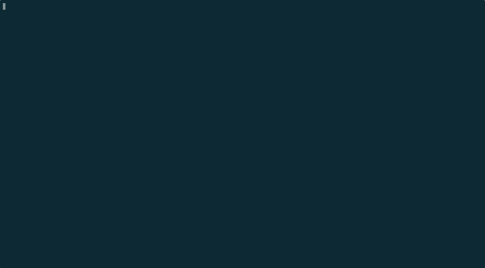

# Reversi Code

<p align="center">
  
</p>

A terminal-based Reversi (Othello) game where you write your strategy in TypeScript. Code a `decideMove()` function in the built-in editor, and watch it play against CPU opponents of increasing difficulty.

## Features

- **Code your strategy** -- Write a `decideMove(board, myColor)` function in TypeScript using the built-in Vim-style editor
- **Sandboxed execution** -- Your code runs in a QuickJS WebAssembly sandbox (1s timeout, 32MB memory limit) each turn
- **4 CPU ranks** to beat:
  - **Rank E** -- Random moves
  - **Rank C** -- Greedy (maximizes flips + corner priority)
  - **Rank A** -- Minimax with alpha-beta pruning
  - **Rank S** -- Bitboard-accelerated deep search
- **Progress tracking** -- Wins and rank unlocks are saved between sessions
- **Terminal UI** -- Built with [@opentui/react](https://github.com/anthropics/opentui) (React for the terminal)

## Requirements

- [Bun](https://bun.sh/) >= 1.0

## Getting Started

```bash
git clone https://github.com/henteko/reversi-code.git
cd reversi-code
bun install
bun src/index.tsx
```

## How to Play

1. Select a CPU rank to challenge
2. Write your `decideMove()` function in the editor
3. Your function receives `board` (8x8 number array) and `myColor` (1 for black, -1 for white)
4. Return `[row, col]` (0-indexed) to place your piece
5. Watch the game unfold turn by turn

### Board Representation

```
board[row][col]:
  0  = empty
  1  = black
 -1  = white
```

### Example Strategy

```typescript
function decideMove(board: number[][], myColor: number): [number, number] {
  // Try corners first
  const corners: [number, number][] = [[0,0], [0,7], [7,0], [7,7]];
  for (const [r, c] of corners) {
    if (board[r][c] === 0) return [r, c];
  }
  // Otherwise pick the first empty cell
  for (let r = 0; r < 8; r++) {
    for (let c = 0; c < 8; c++) {
      if (board[r][c] === 0) return [r, c];
    }
  }
  return [0, 0];
}
```

> Note: Invalid moves or runtime errors result in an immediate forfeit.

## Development

```bash
bun src/index.tsx    # Run the app
bun test             # Run all tests
bun run build        # Compile TypeScript
bunx tsc --noEmit    # Type check only
```

## Tech Stack

- [Bun](https://bun.sh/) -- Runtime
- [@opentui/react](https://github.com/anthropics/opentui) + [React](https://react.dev/) -- Terminal UI
- @sebastianwessel/quickjs -- QuickJS WebAssembly-sandboxed code execution
- [esbuild](https://esbuild.github.io/) -- TypeScript transpilation

## License

MIT
